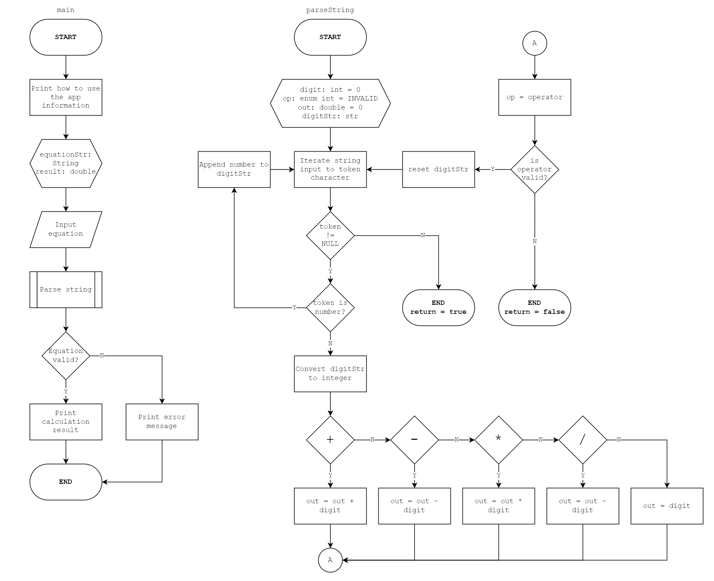

# Simple Calculator Using C
This source code is an assignment for Algorithm and Programming subject session 5-6.

**Task:**
> *Buatlah kalkulator sederhana menggunakan bahasa C dan sertakan flowchart dan pseudocode nya*

```
Name:   Sukriansyah Laksono
NIM:    2702282982
Class:  LD75
```
## Pseudo-code
*This pseudo-code only depict high level logic of the application*

*Please see the flow chart for more detailed depiction of how this application works*

**START**

1. Display information about how to use the calculator app
2. Input the equation users want to calculate from terminal
3. Parse string
4. If there is any invalid input such as alphabet or symbols other than allowed operator symbol, display error message
5. Else, display the result

**END**

## Flowchart
